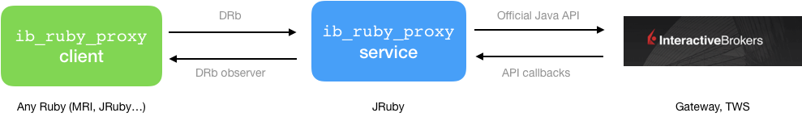

# ib_ruby_proxy

[](https://circleci.com/gh/jorgemanrubia/ib_ruby_proxy)

Service for invoking the [Interactive Brokers (IB) API](https://www.interactivebrokers.com/en/index.php?f=5041) from Ruby.

`ib_ruby_proxy` acts as a mediator between your Ruby code and the IB software making the API calls ([Gateway](https://www.interactivebrokers.com/en/index.php?f=16457) or [TWS](https://www.interactivebrokers.com/en/index.php?f=16457)). Internally, it invokes the official IB Java API and translates objects between Ruby and Java worlds. It also translates method and callback names so that you can use Ruby convention (underscore) instead of Java's (camelcase).

By design, `ib_ruby_proxy` mimics the IB API design where one entity is used to make all the API calls (`EClientSocket`) and another entity is used to receive all the callback responses (`EWrapper`). Also, `ib_ruby_proxy` relies on the official [IB Java API implementation](https://interactivebrokers.github.io). Both decisions aim to increase robustness, instead of making lower level API invocations through sockets or elaborated abstractions over how the API works.

The `ib_ruby_proxy` service needs JRuby installed. Clients of the service can use any standard Ruby distribution. Internally, it uses [DRb](https://ruby-doc.org/stdlib-2.6.3/libdoc/drb/rdoc/DRb.html) to communicate client and server.



## Usage

### `ib_ruby_proxy` service

The service requires JRuby 9.2 or higher available in the system.

```
gem install ib_ruby_proxy
```

Start the process by executing this command, with JRuby configured as the Ruby interpreter:

`ibproxy`

Alternatively, you can just clone this repository and run `bin/ibproxy` (there is a `.ruby-version` file specifying the right JRuby version).

By default, it will connect to the IB Gateway software at port `4002` and expose a DRb connection for clients at port `1992`. You can configure both with options `--ib-port` and `--drb-port`. Use `ibproxy help` to see the options available.

### Clients

Clients can use any Ruby distribution supporting DRb, including MRI and JRuby. To use in your app add this to your `Gemfile`:

```ruby
gem 'ib_ruby_proxy'
```

#### Plain approach

First, you instantiate a client object to make the API calls:

```ruby
client = IbRubyProxy::Client::Client.from_drb
```

Now you can use `client` to invoke API methods. It will use Ruby conventions so, for example, it would be `req_historical_ticks` instead of `reqHistoricalTicks`.

To receive callbacks, use an `IbRubyProxy::Client::IbCallbacksObserver` implementing the callback methods you want to handle. Again, callback names will use Ruby conventions.

For example, say you want to get the historical ticks for Apple (AAPL). IB API supports this with its [api method `reqHistoricalTicks` and a callback `historical_ticks` to receive the ticks](https://interactivebrokers.github.io/tws-api/historical_time_and_sales.html). The full example with `ib_ruby_proxy` looks like this:

```ruby
client = IbRubyProxy::Client::Client.from_drb

class CallbacksObserver < IbRubyProxy::Client::IbCallbacksObserver
  def historical_ticks(_request_id, ticks, _done)
    pp ticks
  end
end

aapl = IbRubyProxy::Client::Ib::Contract.new symbol: 'AAPL',
                                             sec_type: 'STK',
                                             exchange: 'ISLAND'

client.add_ib_callbacks_observer CallbacksObserver.new
client.req_historical_ticks(18009, aapl, '20190304 12:00:00', nil, 100,
                            'MIDPOINT', 1, false, nil)
```


#### Mapped callbacks

`ib_ruby_proxy` support passing a block to the API methods and have this block invoked with the corresponding received callbacks. The yielded params will include the callback name and the list of arguments accepted by the callback.

```ruby
client.req_historical_ticks(18009, aapl, nil, '20190304 17:00:00', 100,
                            'MIDPOINT', 1, false, nil) do |_callback, _request_id, ticks, _done|
  pp ticks
end
```

This feature is currently under development, and not all the mappings have been configured yet. Please check [how to add custom mappings](#custom-mappings) if you want to contribute new mappings (pull requests welcomed).

## Development

### How things work internally

There are 2 mains subsystems: [`server`](https://github.com/jorgemanrubia/ib_ruby_proxy/tree/aa4875dbeac27eeae4f7e71825761b86cdcce342/lib/ib_ruby_proxy/server) and [`client`](https://github.com/jorgemanrubia/ib_ruby_proxy/tree/aa4875dbeac27eeae4f7e71825761b86cdcce342/lib/ib_ruby_proxy/client). `server` is where most of the magic happens and contains the code that runs the `ib_ruby_proxy` service. `client` is the module that contains the code that clients use, including [Ruby representation of IB data classes](https://github.com/jorgemanrubia/ib_ruby_proxy/tree/aa4875dbeac27eeae4f7e71825761b86cdcce342/lib/ib_ruby_proxy/client/ib).

On the server side, there are Ruby equivalents for IB `ESocketClient` ( [`IbClientAdapter`](https://github.com/jorgemanrubia/ib_ruby_proxy/blob/bf4dbba5bf21f0f7cc9b2754244b8af939ad8c8a/lib/ib_ruby_proxy/server/ib_client_adapter.rb)) and `EWrapper` ([`IbWrapperAdapter`](https://github.com/jorgemanrubia/ib_ruby_proxy/blob/3ef8db78cfa3483b1dd93e2ef2ad360f140104f9/lib/ib_ruby_proxy/server/ib_wrapper_adapter.rb)) that analyze the corresponding Java classes and generate equivalent ruby methods on the fly. The [class exposed by DBb](https://github.com/jorgemanrubia/ib_ruby_proxy/blob/aa4875dbeac27eeae4f7e71825761b86cdcce342/lib/ib_ruby_proxy/client/client.rb) is a thin wrapper for `ESocketClient`.

For converting data between Java and Ruby, the system relies on objects presenting 2 methods: `#to_ib` and `#to_ruby`. These methods are added automatically by [code generation for IB data classes](#generated-ruby-representations-of-java-ib-classes), and [dynamically with class extensions for other types](https://github.com/jorgemanrubia/ib_ruby_proxy/tree/31e688ed7e34790e07d9361970a2a6c66c234463/lib/ib_ruby_proxy/server/ext).

### Generated Ruby representations of Java IB classes

The IB API defines several [value object](https://martinfowler.com/bliki/ValueObject.html) classes to represent the interchanged data. For example, `com.ib.client.Bar` represents a candlestick of market data.

`ib_ruby_proxy` includes a code generation utility that analyzes the IB Java classes and generates:

- For the client side, a [Ruby representation of each IB class](https://www.rubydoc.info/github/jorgemanrubia/ib_ruby_proxy/IbRubyProxy/Client/Ib). These classes contain all the data properties and, also, a method for converting them into their Java counterparts. 
- For the server side, it extends each Java class to make them convertible into their Ruby counterparts.

The list of generated classes is defined by the property `classes` of `lib/ib_ruby_proxy/config.yml`. 

To execute the code generation script run:

```
bin/generate_ruby_classes
```

### Custom mappings

The *mapped callbacks* can be configured in the section `mapped_callbacks` of `lib/ib_ruby_proxy/config.yml`.

Each entry includes the name of the API method and a list of the callback methods related to that API call. The optional property `discriminate_by_argument_nth` is used for associating callbacks and methods based on the value of a given argument. This will be the *request identifier* in most cases.

```ruby
 req_historical_ticks:
     callbacks:
        - historical_ticks
        - historical_ticks_bid_ask
        - historical_ticks_last
    discriminate_by_argument_nth: 0
```

## Difference with ib-ruby

[ib-ruby](https://github.com/ib-ruby/ib-ruby) is a mature Ruby alternative for using Interactive Brokers that uses a different approach: it interacts with IB by interchanging lower level messages via sockets. It also offers a higher-level abstraction of the IB API. I prefer the approach of `ib_ruby_proxy` (I wouldn't have created it otherwise), but `ib-ruby` has been around for a long time, it is well maintained and eliminates the dependency of JRuby. You should definitely give it a try if you are thinking in invoking IB from Ruby.

## Links

- [Blog post](https://www.jorgemanrubia.com/2019/07/07/invoke_the_interactive_brokers_api_from_ruby/)
- [Api docs](https://www.rubydoc.info/github/jorgemanrubia/ib_ruby_proxy)

## Contributing

Bug reports and pull requests are welcome on GitHub at https://github.com/jorgemanrubia/ib_ruby_proxy.

## License

The gem is available as open source under the terms of the [MIT License](https://opensource.org/licenses/MIT).
